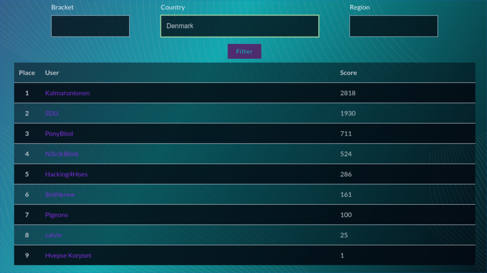
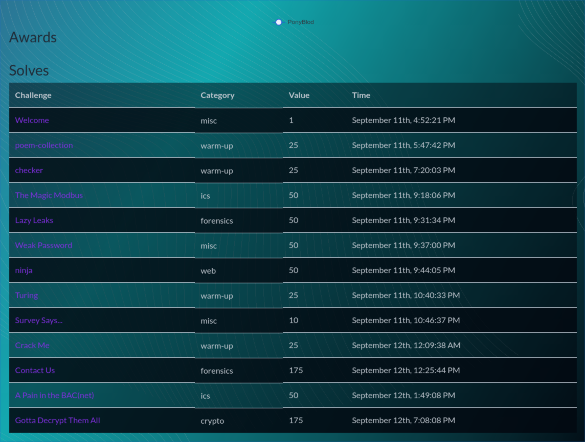

Team PonyBlod has participated in the first CTF as a team.

We joined in on the `CSAW 2021 CTF` Saturday evening at ~6PM. Quickly we gathered together and started hacking away.

It didn't take long before the first challenges was hacked and we got some flags.

Neither did it take long before we started struggling with some challenges. Some of us jumped around and others was stuck for hours.

Sunday we ended up with a half team, but we did still manage to advance on the scoreboard. \
Around noon we were on a 2nd place out of 8 teams in `Denmark`

But we got overtaken in the last hours by another team called `SDU`.

Overall it has been a fun experience and some nice challenges, we all learned something new, which is the reason for us to play.

We joined in rather spontaneous so none of us prepared for write-ups or any other kind of documentation on how we solved the challenges. We hope this will be possible with some better planning before joining the next CTF.

This is a list of all of the challenges we solved

