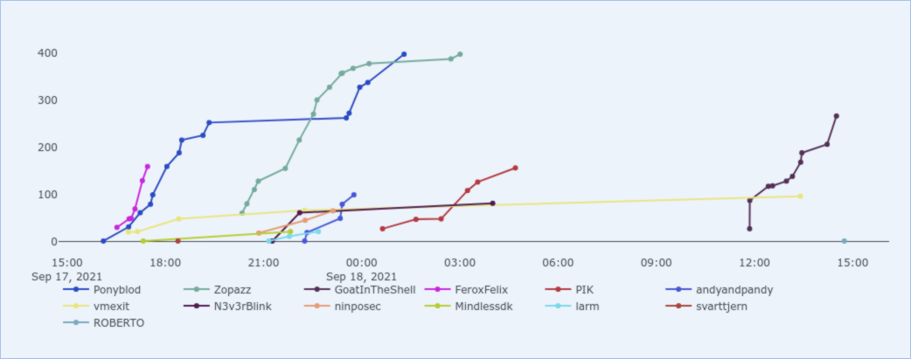

BSides KBH 2021 CTF

Ponyblod participated in a CTF again this weekend. \
The event was kicking off friday 17th at 4pm, on a new platform called haaukins. \
It was a new experience and the configuration for the VPN was a bit diffrerent, but when we were online it worked out really well.

We participated with a total of 4 members but we were mostly 3 online at a time.
Some of us knew the platform and the solutions to some of the challenges, as they were reused. \
But those who knew the solutions didn't solve the challenges or gave out any hint.

So we had the same terms as anyone else.


We managed to solve the first 10 challenges in about 3 hours or so. We haven't been cleared to publish writeups on most of the challenges, as they are getting reused for it security students which we fully respect.

So as a new take on CTF, this years bside had a new challenge category called defense.
The challenges consisted of a vulnerable machine, which you had root access to. This box would run some kind of application, and your job was to refactor the code so it wasn't vulnerable.

For testing out if your fix was implemented correctly and without disrupting the service, another machine had a web interface where you could run a test. If you passed the test, it would give you a flag. \
This kind of challenge was different in many ways, but it worked out really well and they were fun to solve.

If you wanna know more take a look on this [GitHub repository](https://github.com/Sythnog/DefensiveCTFChalTemplate)

## My Travels


After ssh into the box as root, this is the code running the service

```python
from flask import Flask, make_response, render_template, request

# Setup the flask app
app = Flask(__name__)

# -== Endpoint functionality ==-

# Index page
@app.route("/", methods=["GET"])
def Index():
    # Get the story location from URL parameters
    storyFileLoc = "stories/" + str(request.args.get("story"))

    # Attempt to open the file, if not possible then show the user a hardcoded message 
    try:
        # Open the file from the system and read the lines of it into our var
        with open(storyFileLoc, "r") as storyFile:
            storyFromFile = storyFile.readlines()
    except Exception:
        storyFromFile = ["Please select a story above, if you already did then an error occurred."]

    # Make the website using Flasks template-functionality (jinja2)
    webPage = make_response(render_template("index.html", story=storyFromFile))

    # Set content-type header, and send the webpage
    webPage.headers["Content-Type"] = "text/html"
    return webPage

# -== Start server ==-
if __name__ == "__main__":
    app.run(threaded=True, debug=False, port=80, host="0.0.0.0")
```

So going through this code, it's very clear that this vulnerability is LFI, as there is no validation of the request arguments which is used to open files.

For adding a quick fix again we could instead create a dict containing the valid filepath, so instead of opening the files based on the path specified in the request argument, we can use this argument as a key to get the path from a dictionary.

So this is the fixed code

```python
from flask import Flask, make_response, render_template, request
import glob

# Setup the flask app
app = Flask(__name__)

# -== Endpoint functionality ==-

stories = {
        "travelX.txt": "stories/travelX.txt",
        "travelY.txt": "stories/travelY.txt",
        "travelZ.txt": "stories/travelZ.txt"
}

# Index page
@app.route("/", methods=["GET"])
def Index():
    # Get files from stories
    # whitelistStories = glob.glob("stories/*")

    # Get the story location from URL parameters
    # story= "stories/" + str(request.args.get("story"))

    nofilechecker = True
    # Attempt to open the file, if not possible then show the user a hardcoded message 
    try:
        story = str(request.args.get("story"))
        if story in stories:
            print('yay')
            # Open the file from the system and read the lines of it into our var
            with open(stories[story], "r") as storyFile:
                storyFromFile = storyFile.readlines()
            nofilechecker = False

        if nofilechecker:
            raise Exception

    except Exception:
        storyFromFile = ["Please select a story above, if you already did then an error occurred."]

    # Make the website using Flasks template-functionality (jinja2)
    webPage = make_response(render_template("index.html", story=storyFromFile))

    # Set content-type header, and send the webpage
    webPage.headers["Content-Type"] = "text/html"
    return webPage

# -== Start server ==-
if __name__ == "__main__":
    app.run(threaded=True, debug=False, port=80, host="0.0.0.0")

```


## SuperCalcuRace


So when ssh into the box, this is the code for the service running.

```python
import re
import time
import requests
from flask import Flask, request

# Setup the flask app
app = Flask(__name__)

# -== Global Prameters for Storage ==-

# Who needs a database when you can store info in RAM, right?
users = {}

# -== Helper Functions ==-

# Add a user to the "RAM-Database", returns False if user already exist
def AddUser(Name):
    global users

    # Check if the name already exist
    if Name in users:
        return False
    else:
        # Add a user to the database object, using the name as uniqueID for quick lookup
        users[Name] = {"tokens": 10}
        return True

# Clean non-int chars
def CleanInputToInt(Param):
    cleanParam = re.sub("[^0-9]", "", Param)
    if cleanParam == "":
        return False
    else:
        return int(cleanParam)

# -== Endpoint functionality ==-

# Register a user 
@app.route("/register", methods=["POST"])
def Register():
    # Get the parameter from the request, and check if it is valid
    name = request.form.get("name")
    if name == None or name == "":
        # An error occured, so the API must be a teapot
        return {"error": "Invalid or no name given"}, 418

    # Add the user, and return the relevant status message
    if AddUser(name):
        return {"status": "User registered"}
    else:
        return {"status": "User already exist"}

# Make a calculation for the user
@app.route("/performCalc", methods=["POST"])
def PerformCalc():
    # Get the parameters, and validate they exist
    a = request.form.get("a")
    b = request.form.get("b")
    c = request.form.get("c")
    name = request.form.get("name")
    if a == None or b == None or c == None or name == None:
        # An error occured, so the API must be a teapot
        return {"error": "Missing at least one parameter"}, 418

    # Clean the params, ensuring they are integers
    a = CleanInputToInt(a)
    b = CleanInputToInt(b)
    c = CleanInputToInt(c)

    # Validate the params are still good
    if not type(a) == int or a < 0 or not type(b) == int or b < 0 or not type(c) == int or c < 0:
        # An error occured, so the API must be a teapot
        return {"error": "a, b, or c is not a valid int"}, 418

    # Get the users token amount if it exist, else return an error
    global users
    if name in users:
        userTokens = users[name]["tokens"]
    else:
        # An error occured, so the API must be a teapot
        return {"error": "User not found"}, 418

    # Check user has enough tokens
    if userTokens <= 0:
        # An error occured, so the API must be a teapot
        return {"error": "No more tokens availible, please contact sales to buy more"}, 418

    # Make a request to the SuperComputer to perform the calculation
    data = {"a": a, "b": b, "c": c}
    url = "http://supercomp.supercalcu.hkn/performCalc"
    req = requests.post(url, data=data)

    # Parse data from SuperComputer
    if "error" in req.json():
        # An error occured, so the API must be a teapot
        return {"error": "SuperComputer had a breakdown, so it did not work :("}, 418
    else:
        result = req.json()["value"]

    # Now that the caluclation has been made, then deduct a token from the user, and save this information
    userTokens = userTokens - 1
    users[name]["tokens"] = userTokens

    # As everything went well, then return this information to the user
    return {
        "status": "Success",
        "tokensLeft": userTokens,
        "value": result
    }

# -== Start server ==-
if __name__ == "__main__":
    app.run(debug=False, port=80, host="0.0.0.0")
```

The first thing to note is the `users = {}` which apparently is a "database".
So looking through the code, nothing is really able to get manipulated during the request to either `/register` or `/performCalc`.

But one thing is noticable, the deduction of the users tokens are only performed after the response from the super computer. So if you send multiple requests at once, they will all be calling the `/performCalc` with the same amount of tokens left. This is because the tokens are stored in a variable before the request to the supercomputer, and afterwards being subtracted with 1 before updating the "database"

So a quick fix would be to move the following lines, so they get executed before the request to the supercomputer.

```python
userTokens = userTokens - 1
users[name]["tokens"] = userTokens
```

Obviously this wouldn't be a satisfying solution in a production environment.

But it worked out for getting a flag.

## Conclusion

Unfortunately we lack some notes for the last two defense challenges which was .NET based.

We managed to solve the last challenge at 01:17AM as the first team completing all of the tasks.

Over all it was a fun challenge, even if they were quite easy which makes sense as they are developed for it security students.

We look forward to the next bsides CTF, and hope some more teams will participate.




